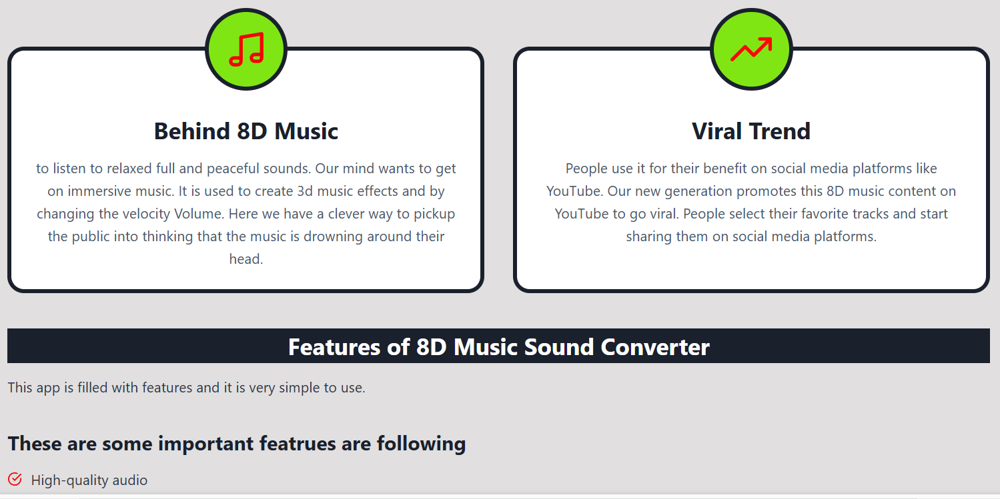

🎮 Introduction
----------
APK8D is a viral gaming and entertainment app that blends arcade-style mini-games with short, addictive video challenges. Developed by 8D Studios and available on Android via APK format, APK8D has quickly gained traction thanks to its dynamic gameplay, diverse content, and shareable moments. Whether you’re into action-packed reaction games or quirky survival puzzles, this app delivers fast-paced fun straight to your fingertips.
>[Download APK8D](https://apkmodjoy.net/apk8d/)
----------

⚔️ Storyline/Objectives
----------
APK8D doesn’t rely on a single storyline—instead, it offers a collection of short games and challenges, each with its own unique goal. From surviving a laser trap to completing a dance move in rhythm, the aim is simple: beat the game, unlock points, and go viral! The app is all about testing your reflexes, timing, and creativity through short yet intense missions.

🕹️ Gameplay
----------
Controls are intuitive—tap, swipe, tilt—depending on the challenge. Some games are solo missions (PvE), while others let you compete with global players in PvP leaderboards. Tasks vary wildly, from dodging falling objects to mimicking dance moves, which keeps things fresh and unpredictable.

🎨 Graphics & Sound
----------
APK8D uses a colorful, 2D animated art style with quirky character designs and expressive visuals. The vibrant soundtrack matches the upbeat tempo of each mini-game, and sound effects enhance the arcade-like feel. Think pixel madness meets TikTok energy.

🛠️ Key Features
----------
* Dozens of bite-sized viral mini-games
* Integrated short video reactions
* Social sharing to TikTok/Instagram
* Offline play mode
* Daily challenges & rewards

⚙️ Requirements
----------
* Android 6.0+
* 150 MB storage space
* APK download via trusted sources (currently not available on Google Play)

💬 Pros & Cons
----------
✔ Fun, fast, and highly replayable
✔ Unique video integration
✘ Some games may feel repetitive over time
✘ No full story mode

🌟 Personal Review
----------
APK8D is addictive, chaotic, and perfect for players looking for a break from long, serious games. It’s ideal for quick fun and sharing viral moments with friends.

📝 Conclusion
----------
If you enjoy TikTok-style creativity mixed with mini-game madness, APK8D is worth checking out. It’s lightweight, free, and full of surprises.

📥 CTA
----------
Download APK8D today and join the viral fun—can you survive all the challenges? Let the chaos begin!
